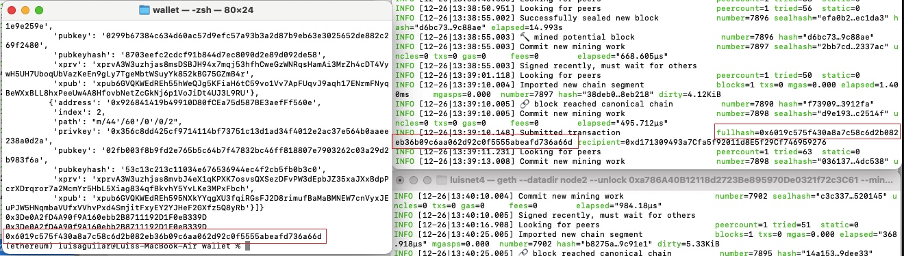
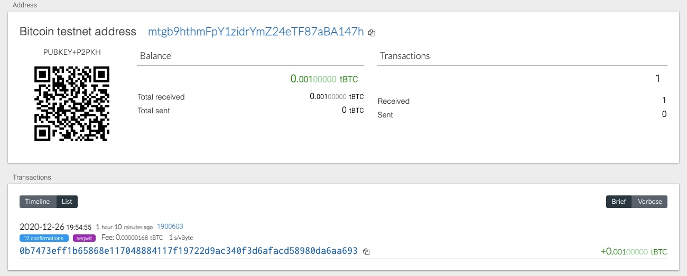

# Multi-Blockchain-Wallet-With-Python

"Universal" wallet using Python to manage multiple crypto coins

### Purpose

In this project, we are creating a multi-blockchain wallet using Python to manage all of our company's crypto coins. We will be using the hd-wallet-derive tool to derive bip32 addresses and private keys for our Bitcoin and our many other coins. We will also be using our computer's Terminal or Git Bash interfaces to set up our derive protocols as well as to run our Python script in order to enable us to manage our wallet directly from either interface.

### Installation Requirements

HD-WALLET-DERIVE

Clone the `hd-wallet-derive` tool from Github into your "Wallet" folder using the Terminal or Git Bash interface.
```
 git clone https://github.com/dan-da/hd-wallet-derive
 cd hd-wallet-derive
 php -r "readfile('https://getcomposer.org/installer');" | php
 php composer.phar install
```

### Setting up the hd-wallet-derive tool and wallet Python script

After cloning the `hd-wallet-derive` tool, create a symlink called `derive` into the top level project directory to clean up the command needed to run the script.

```
ln -s hd-wallet-derive/hd-wallet-derive.php derive
```

Open the wallet.py notebook and set your account's mnemonic phrase to pull your account's addresses and keys.

```
mnemonic = os.getenv('MNEMONIC', 'YOUR MNEMONIC PHRASE')
```

Set up the `send_tx` function with the source address in the `account_one` parameter, and the recipient address in the `to` parameter, and the amount to send.

```
private_key = coins['eth'][0]['privkey']
account_one = Account.from_key(private_key)

to = "RECIPIENT ADDRESS"

```

### Sending Transactions via Terminal or Git Bash

Navigate to your wallet directory in Terminal or Git Bash, then run the wallet.py script using Python. 

```
python wallet.py
```

This will run the script in the wallet.py notebook, including execution of the `send_tx` function, which will send coin from your specified source address to the recipient address.




### Sending Transactions for Bitcoin Testnet

Fund a BTCTEST address using a testnet faucet.


View transaction on a Block Explorer




Set up the `send_tx` function with the source address from your BTCTEST in the `account` parameter, and the recipient address in the `to` parameter, and the amount to send.

```
priv_key = coins['btc-test'][0]['privkey']
account = priv_key_to_account(BTCTEST, priv_key)

to = "RECIPIENT ADDRESS"

```

Navigate to your wallet directory in Terminal or Git Bash, then run the wallet.py script using Python. 

```
python wallet.py
```

This will run the script in the wallet.py notebook, including execution of the `send_tx` function, which will send coin from your specified source address to the recipient address.


